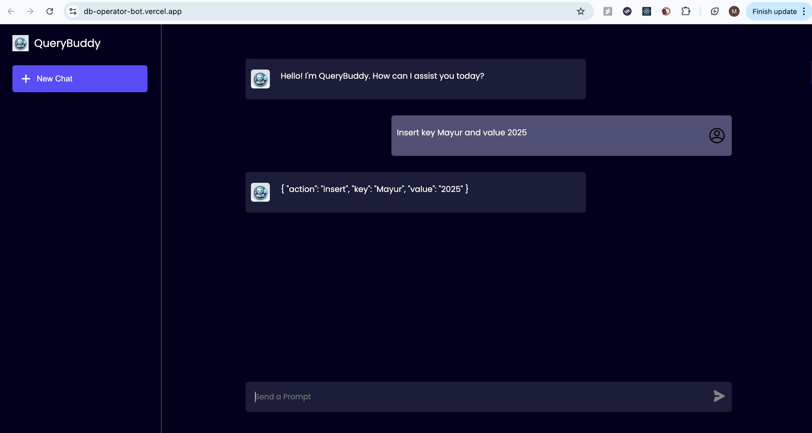
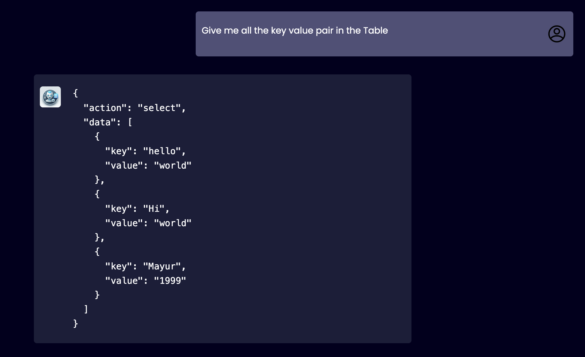

# 🧠 QueryBuddy – AI-Powered Database Assistant

[Live Demo](https://querybuddy.vercel.app)  

QueryBuddy is a full-stack AI assistant that lets users interact with a PostgreSQL database using natural language. Powered by OpenAI + LangChain, it converts chat-style queries into SQL operations (insert, update, select) on a single `userdata` table.

---

## Features

- Chat-based natural language interface
- LangChain + OpenAI-powered SQL generation
- FastAPI backend connected to PostgreSQL
- Fully deployed on:
  - Frontend: Vercel
  - Backend: Render
  - Database: Render PostgreSQL

---

## 🛠️ Tech Stack

**Frontend**
- React + Vite
- Axios for API calls
- Uses environment variable `VITE_API_URL` to connect to backend

**Backend**
- FastAPI + LangChain
- OpenAI model: gpt-3.5-turbo
- Exposes a single endpoint:
  - POST /ask  
    Accepts:

      {
        "question": "Insert key foo and value bar"
      }

**Database**
- PostgreSQL
- Table: `userdata`

      CREATE TABLE IF NOT EXISTS userdata (
        key TEXT PRIMARY KEY,
        value TEXT
      );

---

## 🧪 Example Prompts

- Insert key Mayur and value 2025  
- Update key Mayur to value 1999  
- Give me all the key value pair in the table  

---

## 🖼️ Screenshots

    
    
    

---

## 🚀 Local Setup

**Backend**

    cd DBOperatorAPI
    docker build -t querybuddy-api .
    docker run -p 8000:8000 \
      -e DBUSER=... \
      -e DBPASS=... \
      -e DBHOST=... \
      -e DBPORT=5432 \
      -e DBSCHEMA=... \
      -e OPENAI_API_KEY=sk-... \
      querybuddy-api

**Frontend**

    cd DBOperatorUI
    npm install
    echo "VITE_API_URL=http://localhost:8000" > .env
    npm run dev

---

## ✅ Deployed URLs

- Frontend: https://querybuddy.vercel.app
- Backend: https://dboperatorbot.onrender.com
